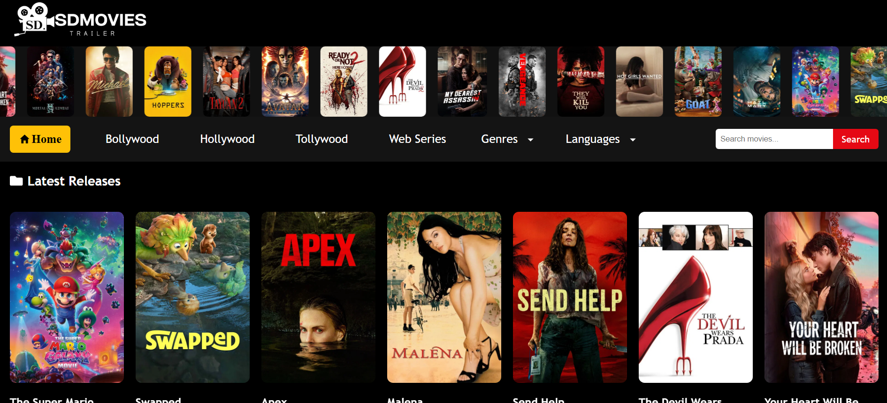
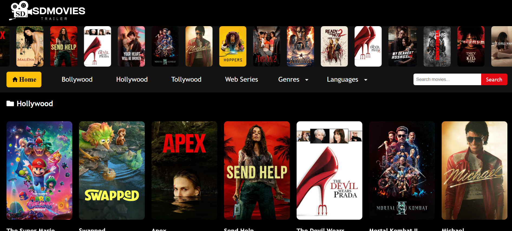
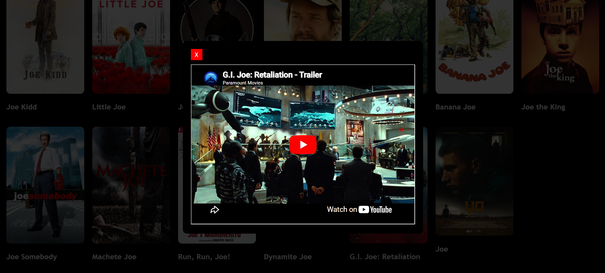
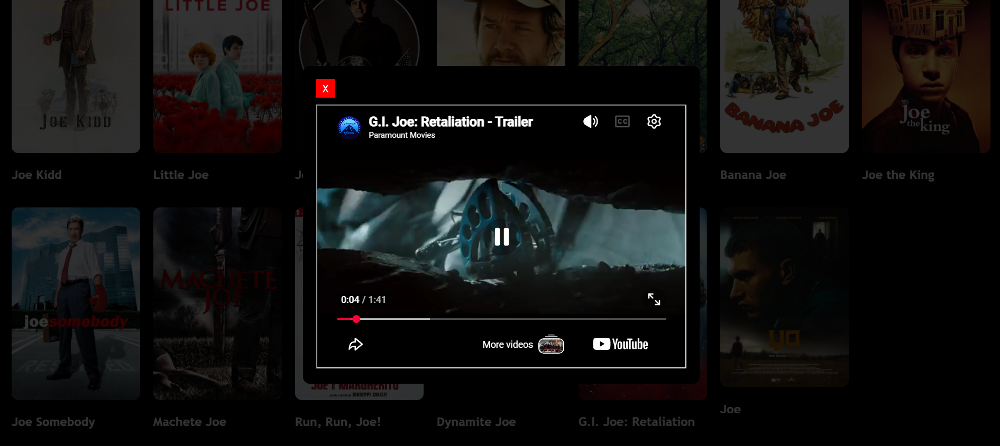
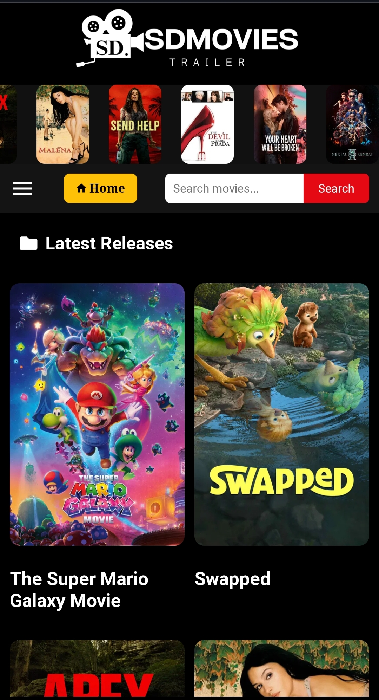
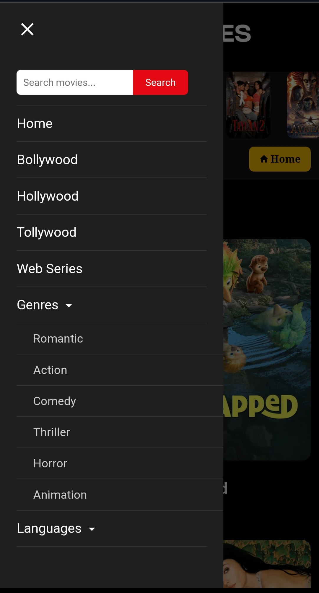
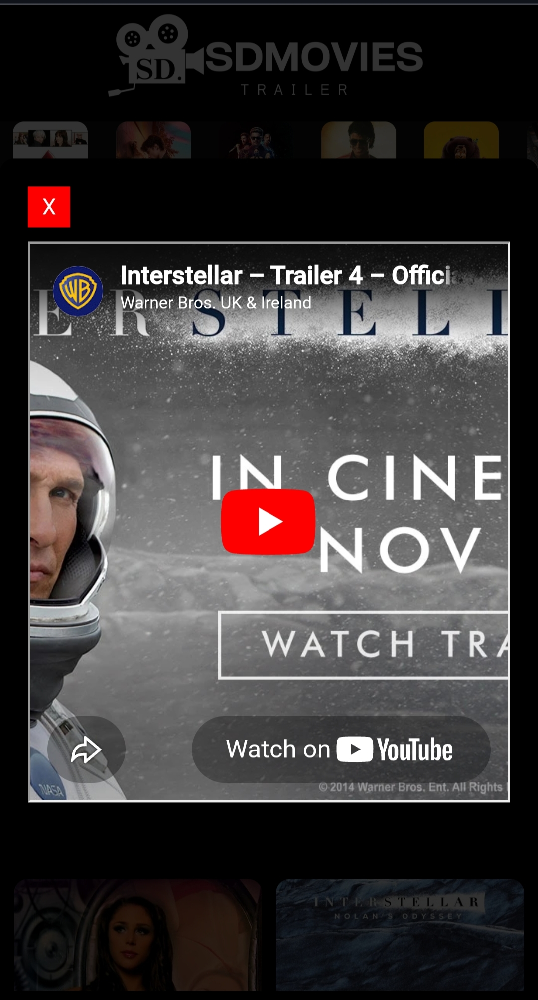
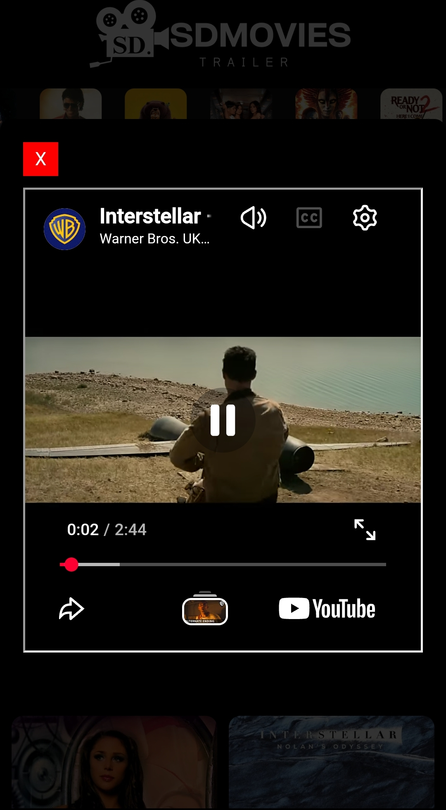

# 🎬 SDMovies – Full Stack Movie Web Application

A full-stack movie browsing web application built using **React (Frontend)** and **Spring Boot (Backend)**.  
The app allows users to search movies, filter by genre and language, and watch trailers in a smooth, responsive UI.

🔗 **Live Website:**  
https://sdmovies-siddhant.netlify.app

🔗 **Backend API:**  
https://sdmovies.onrender.com/api/movies/popular

---

## 🚀 Features

- 🔍 Search movies by name
- 🎭 Filter movies by genre (Romantic, Action, Comedy, etc.)
- 🌍 Filter movies by language (Hindi, English, Marathi, etc.)
- 🎬 Watch movie trailers
- 🎞️ Auto-scrolling movie slider (modern UI)
- 📱 Fully responsive (mobile + desktop)
- ⚡ Fast and smooth performance

---

# 📸 Screenshots

---

# 🖥 Desktop View

## Home Page



## Search Results



## Trailer Modal



## Trailer View



---

# 📱 Mobile View

| Home                                                   | Search                                                      |
| ------------------------------------------------------ | ----------------------------------------------------------- |
|  |  |

| Trailer                                                   | Menu                                                           |
| --------------------------------------------------------- | -------------------------------------------------------------- |
|  |  |

---

## 🛠️ Tech Stack

**Frontend**

- React.js
- JavaScript
- CSS
- React Router

**Backend**

- Spring Boot (Java)
- REST APIs

**Deployment**

- Netlify (Frontend)
- Render (Backend)

**API**

- TMDB (The Movie Database)

---

## 🧠 How It Works

1. User interacts with frontend (React UI)
2. Frontend sends request to backend API
3. Backend fetches data from TMDB API
4. Trailer and movie data is returned and displayed

---

## ⚙️ Running the Project Locally

### Backend (Spring Boot)

```bash
cd backend
./mvnw spring-boot:run
```

API runs on:
https://sdmovies.onrender.com/api/movies/popular

```bash
cd frontend
npm install
npm start
```

App runs on:
http://localhost:3000
or check
https://sdmovies-siddhant.netlify.app
